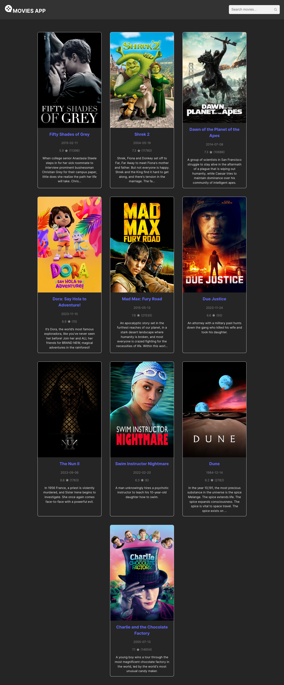
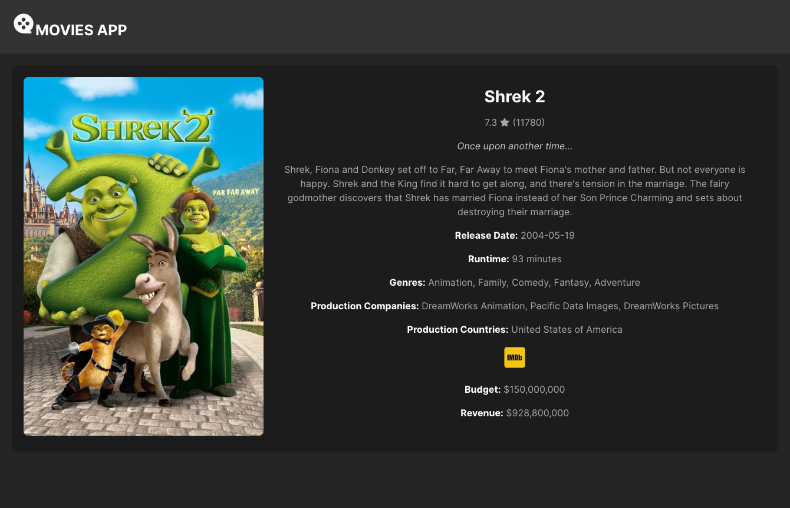

# Movies List

A basic movies list viewer where you can search for a movie and view movie details

I used in this project the following packages: 

- axios (API interface)
- react-query (handling API requests caching)
- react-icons (icons library)
- sass (for better css syntax)

## How to run?

- clone the project
- run `npm i`
- register in [TMDB](https://www.themoviedb.org/), and get your [API key](https://www.themoviedb.org/settings/api) to use it inside the `.env` file
- run the command `npm run dev` and open `http://localhost:5173/` in your browser

## Screenshots

